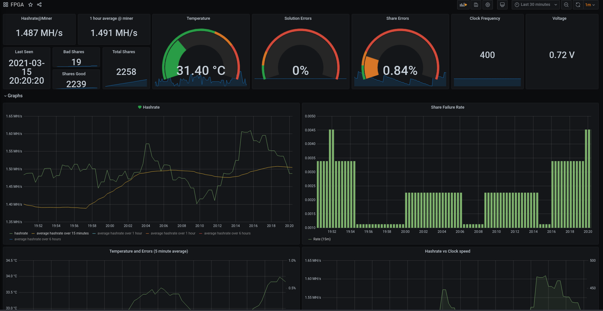

# Overview

A set of python scripts to export prometheus metrics from Whitefires FPGA miners.

Metrics can be captured with prometheus and displayed in a grafana dashboard, where alerts can be set on temperature, hashrates, or errors.



# Supported Bitstreams

0xBitcoin, Registered Bitstream 4 (RB4), Nimiq Version 2

# Quick Run for Ubuntu 18.04 Nimiq Version 2 Miner 

Assuming 1 card/miner. See "Multiple Cards" for running with multiple cards.

## Setup Environment

Download and install prometheus/grafana and setup python environment

```
sudo apt-get install git
git clone https://github.com/pigfrown/whitefire-fpga-metrics
cd whitefire-fpga-metrics
./setup.sh
./setup_python.sh
```

## Redirect miner output 

When you launch the FPGA miner you need to redirect the output to a file that the metric-exporter can read. E.g if you run your miner with

`
./FPGAMinerNIM-Linux-v9 -o wss://nimiq.icemining.ca:2053 -u "NQ59NTCV20L7GU6P6U325SMKA0SEJ12N6YFP" -t 400 
`

you need to change the line to 

`
./FPGAMinerNIM-Linux-v9 -o wss://nimiq.icemining.ca:2053 -u "NQ59NTCV20L7GU6P6U325SMKA0SEJ12N6YFP" -t 400 -p 1001 > /tmp/nimiqmining.log
`

The miner will now output nothing but you can view (or `tail -f`) the file /tmp/nimiqmining.log to see the output.

## Launch metric exporter

You can now launch the metric exporter with:

`
source venv/bin/activate 
cd Nimiq
python metric_exporter.py -m /tmp/nimiqmining.log --cardnames fpga  -p 9092
`

This will launch the metric exporter on port 9092, reading the /tmp/nimiqmining.log logfile, and export the metrics with the "card" label as "fpga". 

## Grafana Configuration

Grafana should be up on port 3000 on your mining box.

Go to localhost:3000 (if on mining box), or $MININGBOXIP:3000 (remotely) to access  grafana, log in with default username "admin", password "admin" and change your password.

### Add Prometheus Datasource to Grafana

* Click "Add data source", select "Prometheus".
* set URL to "http://localhost:9090".
* Ensure name is "local_prometheus".
* Click "Save and Test" and Prometheus should be configured with grafana

### Import Dashboard to Grafana

* On the left hand side of Grafana, click the "+" symbol
* Select Import Dashboard
* make sure you select the prometheus data source that was created earlier
* Click "Upload .json File" and select "grafana-dashboard.json" from the Nimiq directory

# Known issues

If you restart the miner (or it gets restarted by your loop), you will need to restart the metric exporter. Will fix this soon™

Sometimes the miner output gets "stuck" and no more data is put in log file to export, but the miner still running. Only solution right now is to restart miner and exporter. Only seems to happen on RB4.

# Multiple Cards

I only have 1 BCU to test this with, but to run with multiple cards/miners you will need to:

* Redirect each miners output to a different file
* Run metric_exporter.py for each log file, with a different card name and different port
* Add a new target to /etc/prometheus/prometheus.yml for each metric exporter
* Add a variable in grafana which lets you select which "card" label you want to display (and edit the example dashboard to use that variable).

# Multiple Rigs

If you have multiple rigs you should install prometheus+grafana in one location and setup multiple targets in prometheus.yml pointing to all the exported metrics. You can then view your entire farms metrics in one location and set alerts across the entire farm.

# Windows

An .exe for metric exporter is included in the releases section (or you can run with a virtualenv directly with python). You will need to manually install + configure prometheus and grafana on windows, or install it on linux VM/machine elsewhere to handle this.

# Donate/Further Help

If you find this useful and are feeling flush feel free to donate 
BTC: bc1qwmk00gsj0wmuj4spe59jxq07dspzk4ev8aksc6
ETH: 0x83ae8cAB5f3ddF3a0292408297445f6654bF316A

If you need help deploying this across many machines/a large farm, or want custom metric monitoring dashbaords created for your farm, get in touch pigfrown@protonmail.com.

